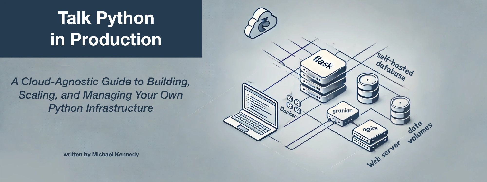

# Talk Python in Production Book 
## Code & Resources Companion Repository

Welcome to Python in Production, the code gallery and resources that accompany the book “[Talk Python in Production](https://talkpython.fm/books/python-in-production)” – a cloud‑agnostic guide to building, scaling, and managing your own Python infrastructure. This repository exists to help readers and curious developers explore the hands‑on examples, scripts, configuration files, and high‑resolution figures described in the book. If you discovered this project first, head over to the book site to read more about the [philosophy]() and to purchase or [read the book online](https://talkpython.fm/books/python-in-production).

## About the book

[Talk Python in Production](https://talkpython.fm/books/python-in-production) is a practical roadmap for running Python applications in the real world. Instead of being locked into hyperscale cloud services or wrestling with brittle, complex DevOps tooling, the book advocates a stack‑native approach: run your own software on a single, powerful server using Docker and proven open‑source tools. You’ll learn how to containerize your apps, proxy them through NGINX, integrate a CDN, and manage the entire stack yourself. It’s aimed at Python developers who want more control over their deployments, lower infrastructure costs, and a deeper understanding of how things work in production.

The book covers a wide range of topics, including:

* Architectures and infrastructure evolution – real‑world hosting journeys from PaaS platforms to multi‑VM setups and beyond.
* One big server strategy – why a well‑configured VM running multiple containers often outperforms a fleet of tiny instances.
* Docker & Docker Compose – containerizing Python web apps, optimizing Dockerfiles, and orchestrating services.
* NGINX & Let’s Encrypt – reverse proxy basics, HTTPS certificates, and secure, efficient routing of traffic.
* Self‑hosted services – running your own analytics, monitoring, and other tools to avoid vendor lock‑in.
* Performance and scaling – caching, CDNs, multiple worker processes, and handling spikes without Kubernetes.
* Migrations & framework choices – moving from legacy frameworks to modern async ones and consolidating servers.

Whether you’re migrating existing applications or starting fresh, the book delivers step‑by‑step tutorials, cost‑saving tips, and lessons learned from years of running high‑traffic Python sites.

## Contributing

Issues, pull requests, and discussions are welcome! If you have questions, ideas for improvements, or success stories about adopting a stack‑native workflow, head over to GitHub Discussions and join the conversation. Please keep contributions focused on improving the examples or clarifying the instructions.

## Learn more

**Read or buy the book** – [talkpython.fm/books/python-in-production](https://talkpython.fm/books/python-in-production) contains the full text, first third of the book online for free, and purchase options.

**Related courses** – Check out [Talk Python Training](https://training.talkpython.fm/courses/all) for courses on Python, web development, and deploying apps.

**Podcast & community** – [Listen to the Talk Python To Me podcast](https://talkpython.fm/episodes/all) and join the community for in‑depth interviews with Python and software professionals.

## Build your own stack

By following the examples in this repository, you’ll learn to deploy Python applications confidently, control your infrastructure costs, and avoid the complexity of hyperscale cloud platforms. Happy shipping!
