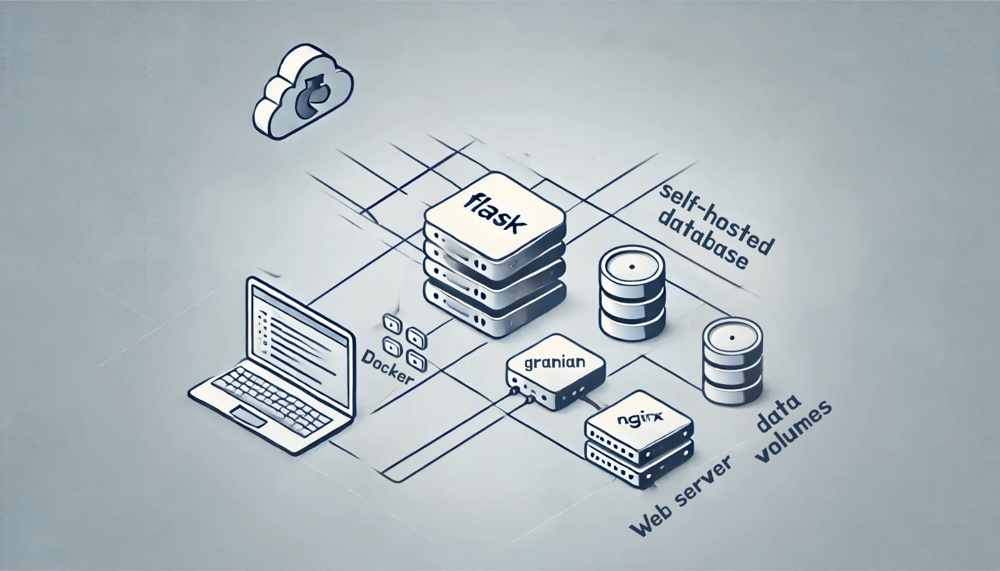

# Image gallery

This gallery contains high-quality versions of all the images in the book. Some readers have very high fidelity with the original: Apple Books or the Kindle App on iPad, the Kindle app on  Android tablets, or even the Kindle app on your PC. Others, not so much. Devices like Kindle e-ink readers, Remarkable tablets, and other e-ink devices often have low pixel density and significantly reduce quality.

**LICENSE**: Images in the image gallery are copyrighted and not available for reuse.

# Gallery: Chapter 03 - One big server rather than many small ones

Figure 03-01: 

----------------------------

# Gallery: Chapter 05 - Running on Rust

Figure 05-01: 

Figure 05-02: 

----------------------------

# Gallery: Chapter 06 - The unexpected benefits of self-hosting

Figure 06-01: 

Figure 06-02: 

Figure 06-03: 

Figure 06-04: 

----------------------------

# Gallery: Chapter 07 - Visualizing servers and other tools

Figure 07-01: 

Figure 07-02: 

Figure 07-03: 

Figure 07-04: 

----------------------------

# Gallery: Chapter 09 - NGINX, containers, and let's encrypt

Figure 09-01: 

----------------------------

# Gallery: Chapter 10 - CDNs

Figure 10-01: 

----------------------------

# Gallery: Chapter 11 - Example Server Setup

Figure 11-01: 

Figure 11-02: 

Figure 11-03: 

Figure 11-04: 

Figure 11-05: 

Figure 11-06: 

Figure 11-07: 

Figure 11-08: 

Figure 11-09: 

Figure 11-10: 

Figure 11-11: 

Figure 11-12: 

Figure 11-13: 

----------------------------

# Gallery: Chapter 12 - Static sites and Hugo

Figure 12-01: 

Figure 12-02: 

Figure 12-03: 

Figure 12-04: 

Figure 12-05: 

Figure 12-06: 

----------------------------

# Gallery: Chapter 13 - Picking a Python web framework

Figure 13-01: 

Figure 13-02: 

Figure 13-03: 

----------------------------

# Gallery: Chapter 14 - Sometimes you should build it yourself

Figure 14-01: 

Figure 14-02: 

Figure 14-03: 

Figure 14-04: 

Figure 14-05: 

Figure 14-06: 

----------------------------

# Gallery: Chapter 15 - Moving to Hetzner (a Retrospective)

Figure 15-01: 

Figure 15-02: 

Figure 15-03: 

----------------------------

# Gallery: Chapter 16 - Opposite of cloud native is?

Figure 16-01: 

Figure 16-02: 

Figure 16-03: 

----------------------------

**LICENSE**: Images in the figure gallery are copyright and not available for reuse. 

