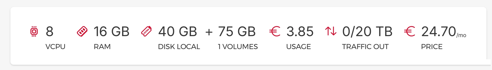

# Image gallery

This gallery contains high-quality versions of all the images in the book. Some readers have very high fidelity with the original: Apple Books or the Kindle App on iPad, the Kindle app on  Android tablets, or even the Kindle app on your PC. Others, not so much. Devices like Kindle e-ink readers, Remarkable tablets, and other e-ink devices often have low pixel density and significantly reduce quality.

**LICENSE**: Images in the image gallery are copyrighted and not available for reuse.

## Chapter 03 Gallery - One Big Server Rather Than Many Small Ones

Figure 03-01: [Workload over time at our server](figures/03-01-workload-talkpython-apps.png)

----------------------------

## Chapter 05 Gallery - Running on Rust

Figure 05-01: [Visualization of Linux running Docker running our infrastructure.](figures/05-01-architecture-tiers.png)

Figure 05-02: [View of processes on Docker host machine.](figures/05-02-granian-lots-of-granian.png)

----------------------------

## Chapter 06 Gallery - The Unexpected Benefits of Self-Hosting

Figure 06-01: [Abstract visualization of our Docker infrastructure.](figures/06-01-server-tree.png)

Figure 06-02: [Event graph in Umami.](figures/06-02-events-chart.png)

Figure 06-03: [Uptime Kuma home page.](figures/06-03-uptime-kuma.png)

Figure 06-04: [Uptime Kuma status page for Talk Python.](figures/06-04-status-talkpython.png)

----------------------------

## Chapter 07 Gallery - Visualizing Servers and Other Tools

Figure 07-01: [btop dashboard updating real-time at Talk Python.](figures/07-01-btop-dashboard.jpg)

Figure 07-02: [btop's graphical options screen, over SSH!](figures/07-02-btop-options.jpg)

Figure 07-03: [Glances dashboard updating real-time at Talk Python.](figures/07-03-glances.jpg)

Figure 07-04: [Docker Cluster Monitor of the containers at Talk Python.](figures/07-04-docker-cluster-monitor.jpg)

----------------------------

## Chapter 09 Gallery - NGINX, Containers, and Let's Encrypt

Figure 09-01: 

----------------------------

## Chapter 10 Gallery - CDNs

Figure 10-01: 

----------------------------

## Chapter 11 Gallery - Example Server Setup

Figure 11-01: 

Figure 11-02: 

Figure 11-03: 

Figure 11-04: 

Figure 11-05: 

Figure 11-06: 

Figure 11-07: 

Figure 11-08: 

Figure 11-09: 

Figure 11-10: 

Figure 11-11: 

Figure 11-12: 

Figure 11-13: 

----------------------------

## Chapter 12 Gallery - Static Sites and Hugo

Figure 12-01: 

Figure 12-02: 

Figure 12-03: 

Figure 12-04: 

Figure 12-05: 

Figure 12-06: 

----------------------------

## Chapter 13 Gallery - Picking a Python Web Framework

Figure 13-01: 

Figure 13-02: 

Figure 13-03: 

----------------------------

## Chapter 14 Gallery - Sometimes You Should Build It Yourself

Figure 14-01: 

Figure 14-02: 

Figure 14-03: 

Figure 14-04: 

Figure 14-05: 

Figure 14-06: 

----------------------------

## Chapter 15 Gallery - Moving to Hetzner (a Retrospective)

Figure 15-01: 

Figure 15-02: 

Figure 15-03: 

----------------------------

## Chapter 16 Gallery - Opposite of Cloud-Native Is?

Figure 16-01: 

Figure 16-02: 

Figure 16-03: 

----------------------------

**LICENSE**: Images in the figure gallery are copyright and not available for reuse. 

